# Tombola Game - Process Flows

This document contains sequence diagrams for all key processes in the Tombola game system, showing the interaction between the web client, Rust API server, and various components.

## 1. Authentication & Registration Flows

### 1.1 Server Authentication Check

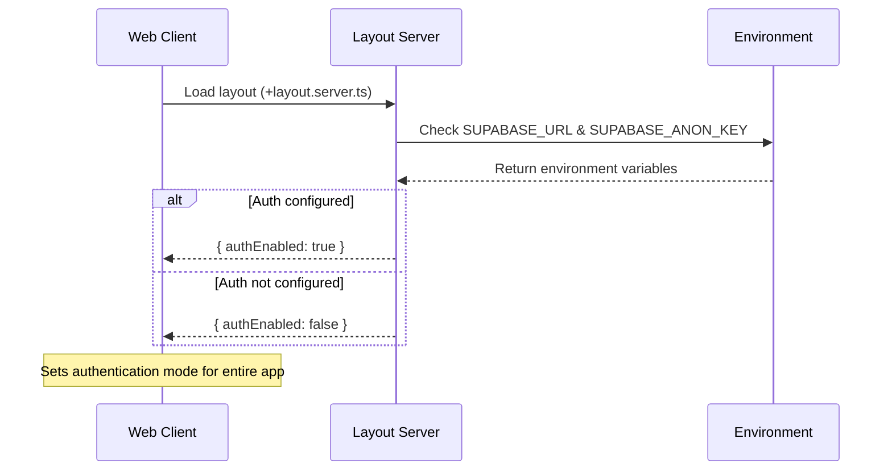
```mermaid
sequenceDiagram
    participant Client as Web Client
    participant Server as Layout Server
    participant Env as Environment

    Client->>Server: Load layout (+layout.server.ts)
    Server->>Env: Check SUPABASE_URL & SUPABASE_ANON_KEY
    Env-->>Server: Return environment variables
    alt Auth configured
        Server-->>Client: { authEnabled: true }
    else Auth not configured
        Server-->>Client: { authEnabled: false }
    end
    Note over Client: Sets authentication mode for entire app
```

### 1.2 Magic Link Authentication Flow (Full Auth Mode)

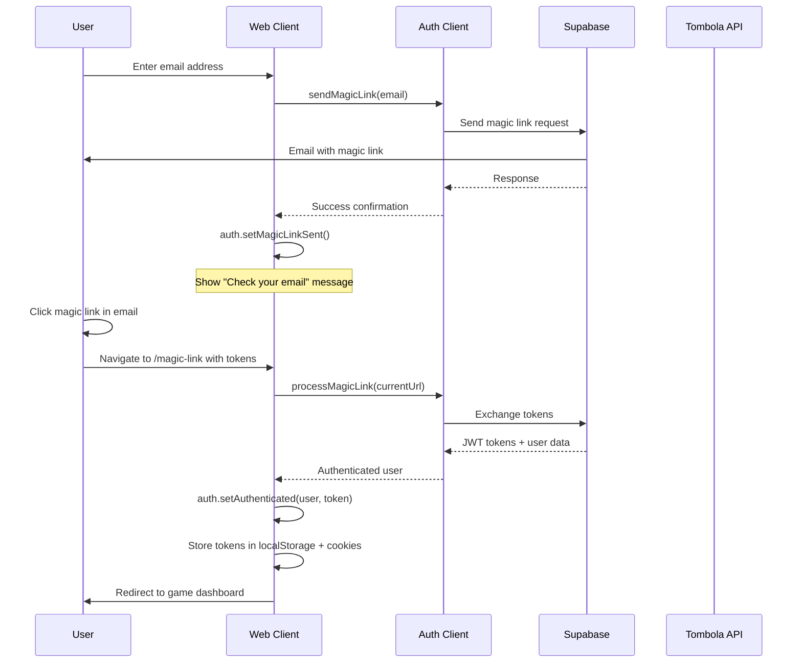
```mermaid
sequenceDiagram
    participant User as User
    participant Client as Web Client
    participant Auth as Auth Client
    participant Supabase as Supabase
    participant API as Tombola API

    User->>Client: Enter email address
    Client->>Auth: sendMagicLink(email)
    Auth->>Supabase: Send magic link request
    Supabase->>User: Email with magic link
    Supabase-->>Auth: Response
    Auth-->>Client: Success confirmation
    Client->>Client: auth.setMagicLinkSent()
    Note over Client: Show "Check your email" message

    User->>User: Click magic link in email
    User->>Client: Navigate to /magic-link with tokens
    Client->>Auth: processMagicLink(currentUrl)
    Auth->>Supabase: Exchange tokens
    Supabase-->>Auth: JWT tokens + user data
    Auth-->>Client: Authenticated user
    Client->>Client: auth.setAuthenticated(user, token)
    Client->>Client: Store tokens in localStorage + cookies
    Client->>User: Redirect to game dashboard
```

### 1.3 Simple Registration Flow (No Auth Mode)

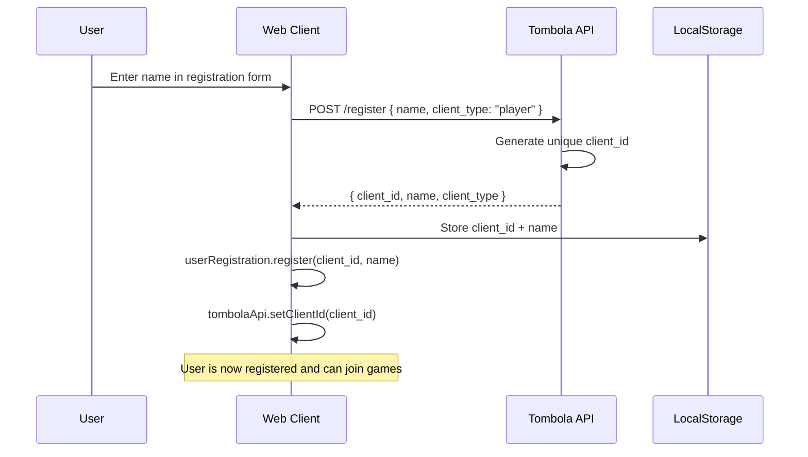
```mermaid
sequenceDiagram
    participant User as User
    participant Client as Web Client
    participant API as Tombola API
    participant LocalStorage as LocalStorage

    User->>Client: Enter name in registration form
    Client->>API: POST /register { name, client_type: "player" }
    API->>API: Generate unique client_id
    API-->>Client: { client_id, name, client_type }
    Client->>LocalStorage: Store client_id + name
    Client->>Client: userRegistration.register(client_id, name)
    Client->>Client: tombolaApi.setClientId(client_id)
    Note over Client: User is now registered and can join games
```

## 2. Game Discovery & Creation Flows

### 2.1 Game List Discovery

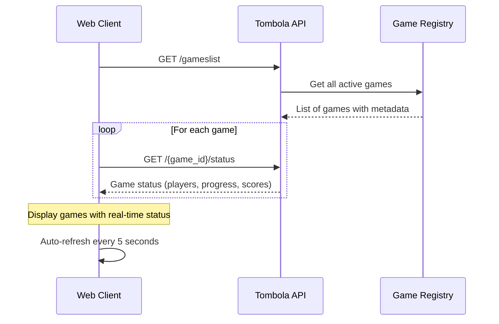
```mermaid
sequenceDiagram
    participant Client as Web Client
    participant API as Tombola API
    participant Registry as Game Registry

    Client->>API: GET /gameslist
    API->>Registry: Get all active games
    Registry-->>API: List of games with metadata

    loop For each game
        Client->>API: GET /{game_id}/status
        API-->>Client: Game status (players, progress, scores)
    end

    Note over Client: Display games with real-time status

    Client->>Client: Auto-refresh every 5 seconds
```

### 2.2 Game Creation Flow (Board Client)

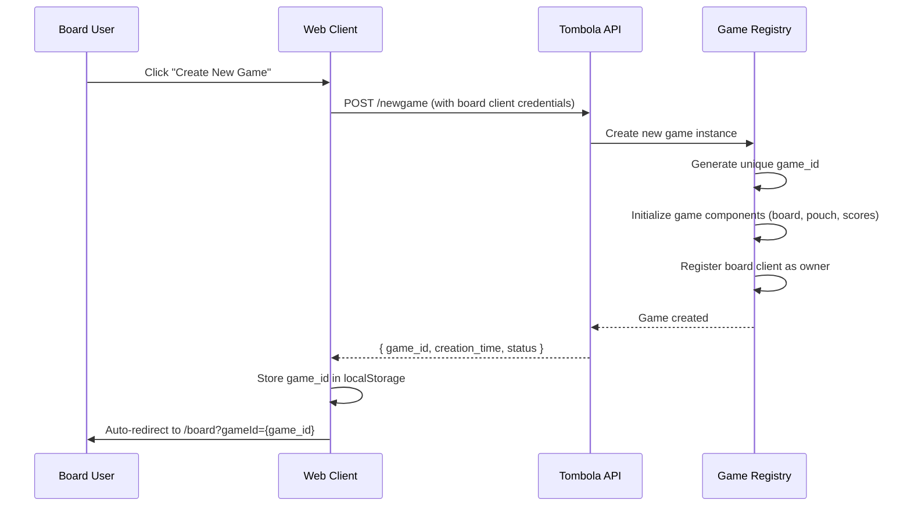
```mermaid
sequenceDiagram
    participant User as Board User
    participant Client as Web Client
    participant API as Tombola API
    participant Registry as Game Registry

    User->>Client: Click "Create New Game"
    Client->>API: POST /newgame (with board client credentials)
    API->>Registry: Create new game instance
    Registry->>Registry: Generate unique game_id
    Registry->>Registry: Initialize game components (board, pouch, scores)
    Registry->>Registry: Register board client as owner
    Registry-->>API: Game created
    API-->>Client: { game_id, creation_time, status }
    Client->>Client: Store game_id in localStorage
    Client->>User: Auto-redirect to /board?gameId={game_id}
```

## 3. Game Joining Flows

### 3.1 Smart Game Joining Logic

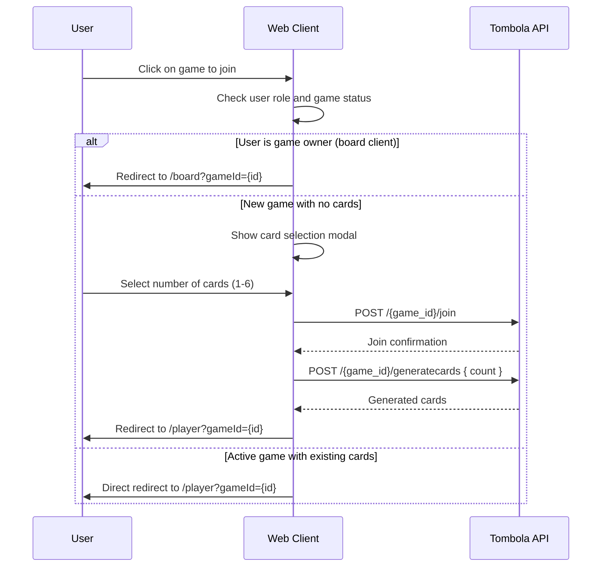
```mermaid
sequenceDiagram
    participant User as User
    participant Client as Web Client
    participant API as Tombola API

    User->>Client: Click on game to join
    Client->>Client: Check user role and game status

    alt User is game owner (board client)
        Client->>User: Redirect to /board?gameId={id}
    else New game with no cards
        Client->>Client: Show card selection modal
        User->>Client: Select number of cards (1-6)
        Client->>API: POST /{game_id}/join
        API-->>Client: Join confirmation
        Client->>API: POST /{game_id}/generatecards { count }
        API-->>Client: Generated cards
        Client->>User: Redirect to /player?gameId={id}
    else Active game with existing cards
        Client->>User: Direct redirect to /player?gameId={id}
    end
```

### 3.2 Player Game Join with Card Generation

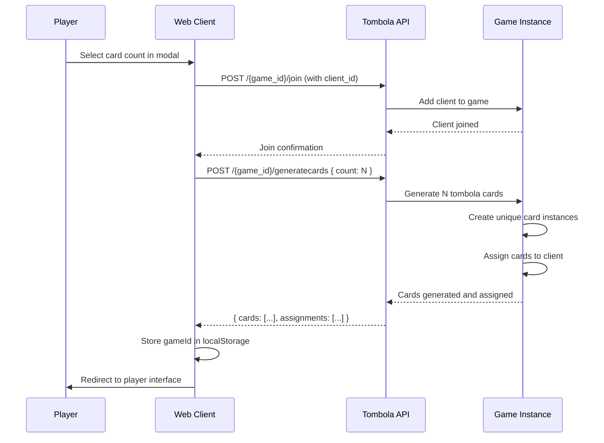
```mermaid
sequenceDiagram
    participant Player as Player
    participant Client as Web Client
    participant API as Tombola API
    participant Game as Game Instance

    Player->>Client: Select card count in modal
    Client->>API: POST /{game_id}/join (with client_id)
    API->>Game: Add client to game
    Game-->>API: Client joined
    API-->>Client: Join confirmation

    Client->>API: POST /{game_id}/generatecards { count: N }
    API->>Game: Generate N tombola cards
    Game->>Game: Create unique card instances
    Game->>Game: Assign cards to client
    Game-->>API: Cards generated and assigned
    API-->>Client: { cards: [...], assignments: [...] }

    Client->>Client: Store gameId in localStorage
    Client->>Player: Redirect to player interface
```

## 4. Gameplay Flows

### 4.1 Board Operator Flow (Number Extraction)

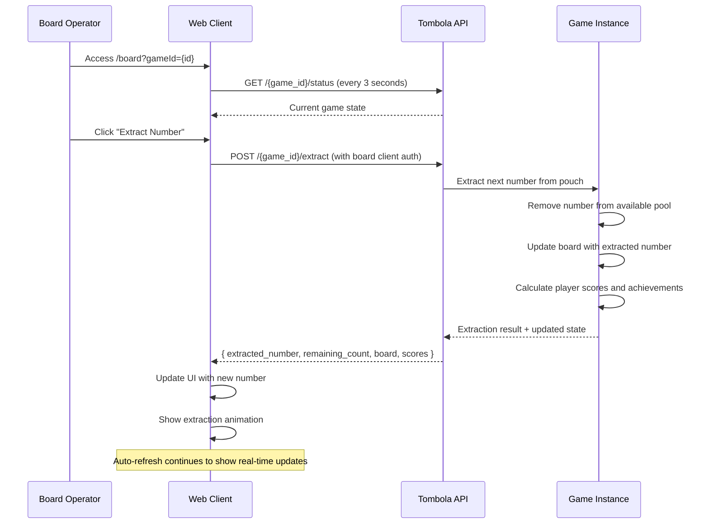
```mermaid
sequenceDiagram
    participant Operator as Board Operator
    participant Client as Web Client
    participant API as Tombola API
    participant Game as Game Instance

    Operator->>Client: Access /board?gameId={id}
    Client->>API: GET /{game_id}/status (every 3 seconds)
    API-->>Client: Current game state

    Operator->>Client: Click "Extract Number"
    Client->>API: POST /{game_id}/extract (with board client auth)
    API->>Game: Extract next number from pouch
    Game->>Game: Remove number from available pool
    Game->>Game: Update board with extracted number
    Game->>Game: Calculate player scores and achievements
    Game-->>API: Extraction result + updated state
    API-->>Client: { extracted_number, remaining_count, board, scores }

    Client->>Client: Update UI with new number
    Client->>Client: Show extraction animation

    Note over Client: Auto-refresh continues to show real-time updates
```

### 4.2 Player Card Monitoring Flow

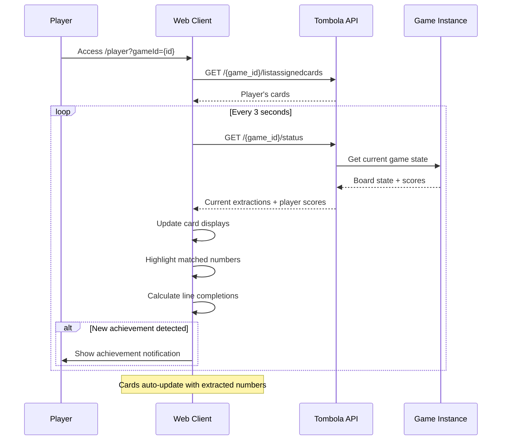
```mermaid
sequenceDiagram
    participant Player as Player
    participant Client as Web Client
    participant API as Tombola API
    participant Game as Game Instance

    Player->>Client: Access /player?gameId={id}
    Client->>API: GET /{game_id}/listassignedcards
    API-->>Client: Player's cards

    loop Every 3 seconds
        Client->>API: GET /{game_id}/status
        API->>Game: Get current game state
        Game-->>API: Board state + scores
        API-->>Client: Current extractions + player scores

        Client->>Client: Update card displays
        Client->>Client: Highlight matched numbers
        Client->>Client: Calculate line completions

        alt New achievement detected
            Client->>Player: Show achievement notification
        end
    end

    Note over Client: Cards auto-update with extracted numbers
```

### 4.3 Real-time Score Calculation

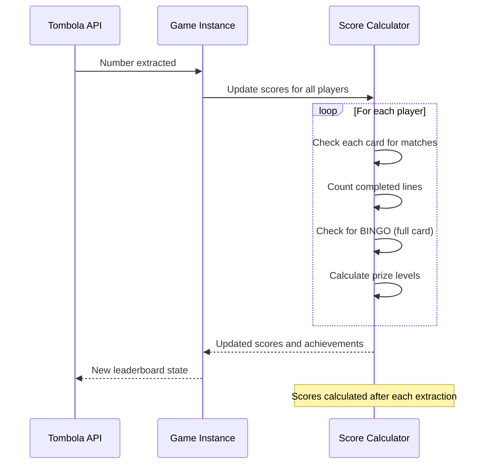
```mermaid
sequenceDiagram
    participant API as Tombola API
    participant Game as Game Instance
    participant ScoreCard as Score Calculator

    API->>Game: Number extracted
    Game->>ScoreCard: Update scores for all players

    loop For each player
        ScoreCard->>ScoreCard: Check each card for matches
        ScoreCard->>ScoreCard: Count completed lines
        ScoreCard->>ScoreCard: Check for BINGO (full card)
        ScoreCard->>ScoreCard: Calculate prize levels
    end

    ScoreCard-->>Game: Updated scores and achievements
    Game-->>API: New leaderboard state

    Note over ScoreCard: Scores calculated after each extraction
```

## 5. State Management Flows

### 5.1 Client State Synchronization

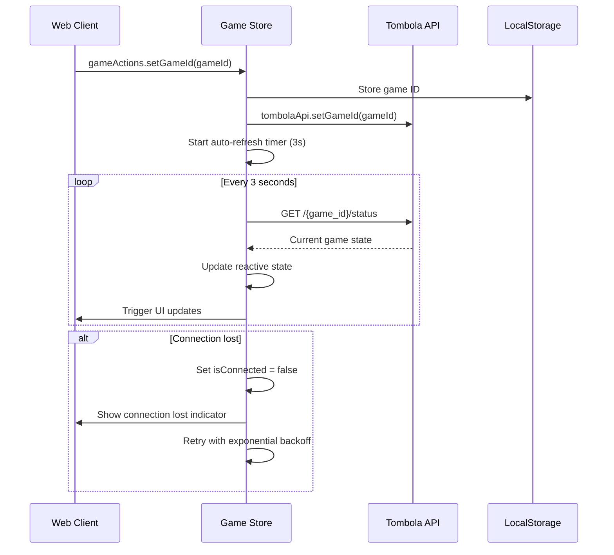
```mermaid
sequenceDiagram
    participant Client as Web Client
    participant GameStore as Game Store
    participant API as Tombola API
    participant LocalStorage as LocalStorage

    Client->>GameStore: gameActions.setGameId(gameId)
    GameStore->>LocalStorage: Store game ID
    GameStore->>API: tombolaApi.setGameId(gameId)

    GameStore->>GameStore: Start auto-refresh timer (3s)

    loop Every 3 seconds
        GameStore->>API: GET /{game_id}/status
        API-->>GameStore: Current game state
        GameStore->>GameStore: Update reactive state
        GameStore->>Client: Trigger UI updates
    end

    alt Connection lost
        GameStore->>GameStore: Set isConnected = false
        GameStore->>Client: Show connection lost indicator
        GameStore->>GameStore: Retry with exponential backoff
    end
```

### 5.2 Multi-Game State Isolation

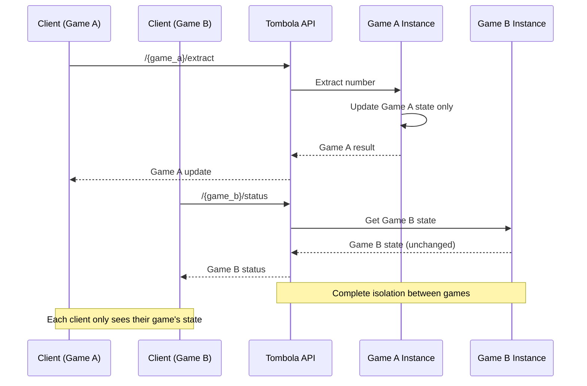
```mermaid
sequenceDiagram
    participant Client1 as Client (Game A)
    participant Client2 as Client (Game B)
    participant API as Tombola API
    participant GameA as Game A Instance
    participant GameB as Game B Instance

    Client1->>API: /{game_a}/extract
    API->>GameA: Extract number
    GameA->>GameA: Update Game A state only
    GameA-->>API: Game A result
    API-->>Client1: Game A update

    Client2->>API: /{game_b}/status
    API->>GameB: Get Game B state
    GameB-->>API: Game B state (unchanged)
    API-->>Client2: Game B status

    Note over API,GameB: Complete isolation between games
    Note over Client1,Client2: Each client only sees their game's state
```

## 6. Error Handling & Recovery Flows

### 6.1 Connection Recovery Flow

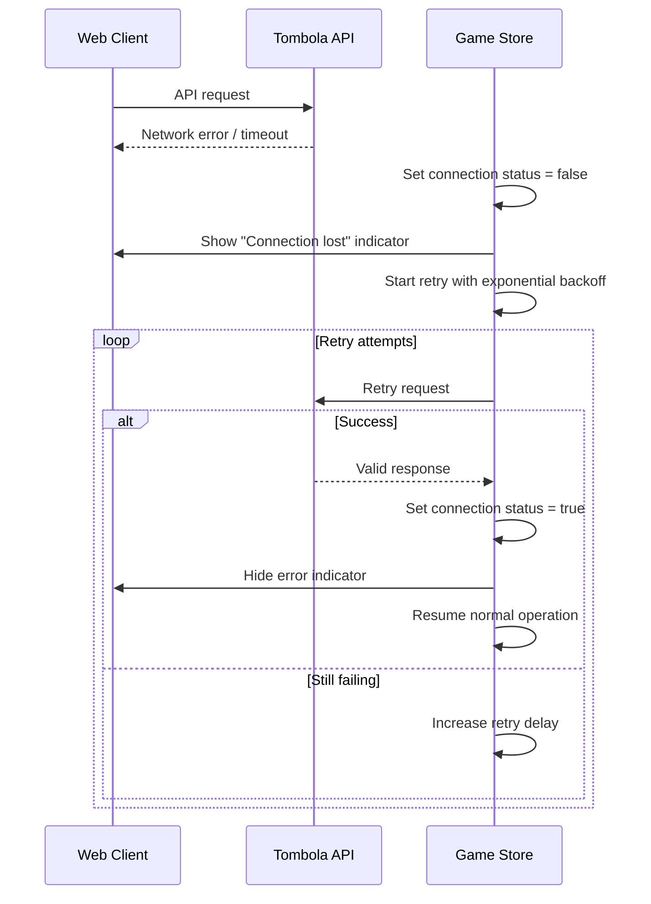
```mermaid
sequenceDiagram
    participant Client as Web Client
    participant API as Tombola API
    participant GameStore as Game Store

    Client->>API: API request
    API-->>Client: Network error / timeout

    GameStore->>GameStore: Set connection status = false
    GameStore->>Client: Show "Connection lost" indicator

    GameStore->>GameStore: Start retry with exponential backoff

    loop Retry attempts
        GameStore->>API: Retry request
        alt Success
            API-->>GameStore: Valid response
            GameStore->>GameStore: Set connection status = true
            GameStore->>Client: Hide error indicator
            GameStore->>GameStore: Resume normal operation
        else Still failing
            GameStore->>GameStore: Increase retry delay
        end
    end
```

### 6.2 Authentication Recovery Flow

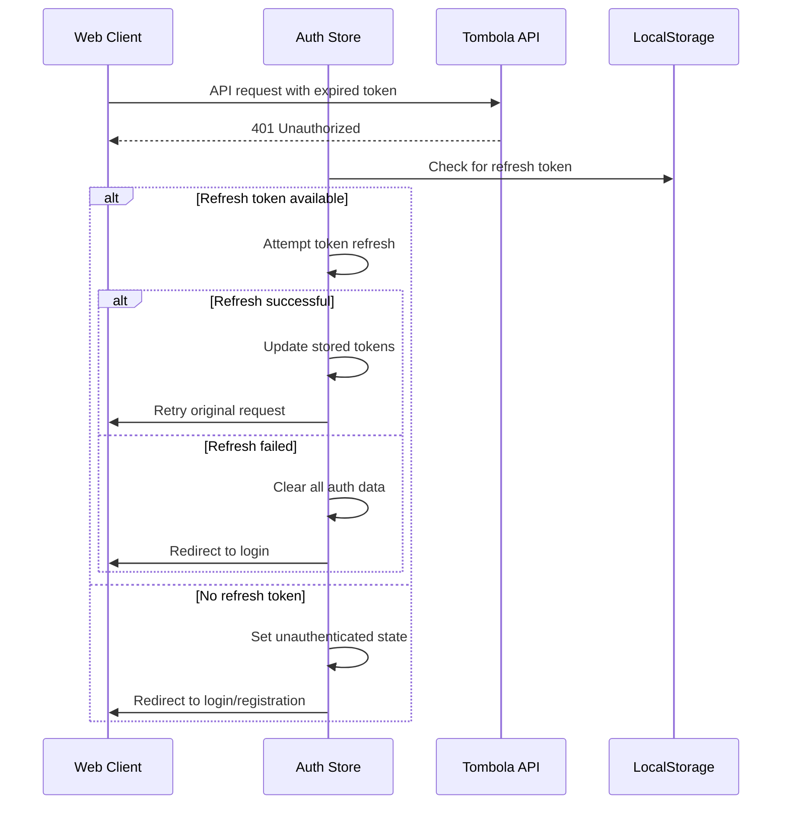
```mermaid
sequenceDiagram
    participant Client as Web Client
    participant Auth as Auth Store
    participant API as Tombola API
    participant LocalStorage as LocalStorage

    Client->>API: API request with expired token
    API-->>Client: 401 Unauthorized

    Auth->>LocalStorage: Check for refresh token

    alt Refresh token available
        Auth->>Auth: Attempt token refresh
        alt Refresh successful
            Auth->>Auth: Update stored tokens
            Auth->>Client: Retry original request
        else Refresh failed
            Auth->>Auth: Clear all auth data
            Auth->>Client: Redirect to login
        end
    else No refresh token
        Auth->>Auth: Set unauthenticated state
        Auth->>Client: Redirect to login/registration
    end
```

## 7. Navigation & Session Management Flows

### 7.1 Session Persistence During Navigation

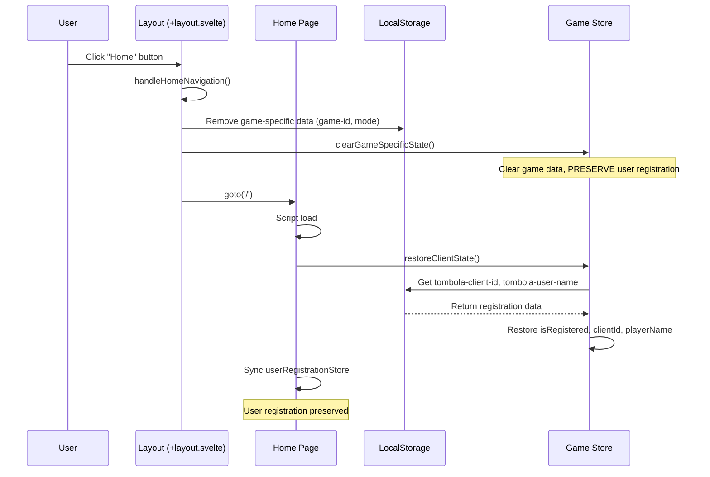
```mermaid
sequenceDiagram
    participant User as User
    participant Layout as Layout (+layout.svelte)
    participant HomePage as Home Page
    participant LocalStorage as LocalStorage
    participant GameStore as Game Store

    User->>Layout: Click "Home" button
    Layout->>Layout: handleHomeNavigation()
    Layout->>LocalStorage: Remove game-specific data (game-id, mode)
    Layout->>GameStore: clearGameSpecificState()
    Note over GameStore: Clear game data, PRESERVE user registration
    Layout->>HomePage: goto('/')

    HomePage->>HomePage: Script load
    HomePage->>GameStore: restoreClientState()
    GameStore->>LocalStorage: Get tombola-client-id, tombola-user-name
    LocalStorage-->>GameStore: Return registration data
    GameStore->>GameStore: Restore isRegistered, clientId, playerName
    HomePage->>HomePage: Sync userRegistrationStore
    Note over HomePage: User registration preserved
```

### 7.2 Fixed Session Loss Issue (Previous Problem)

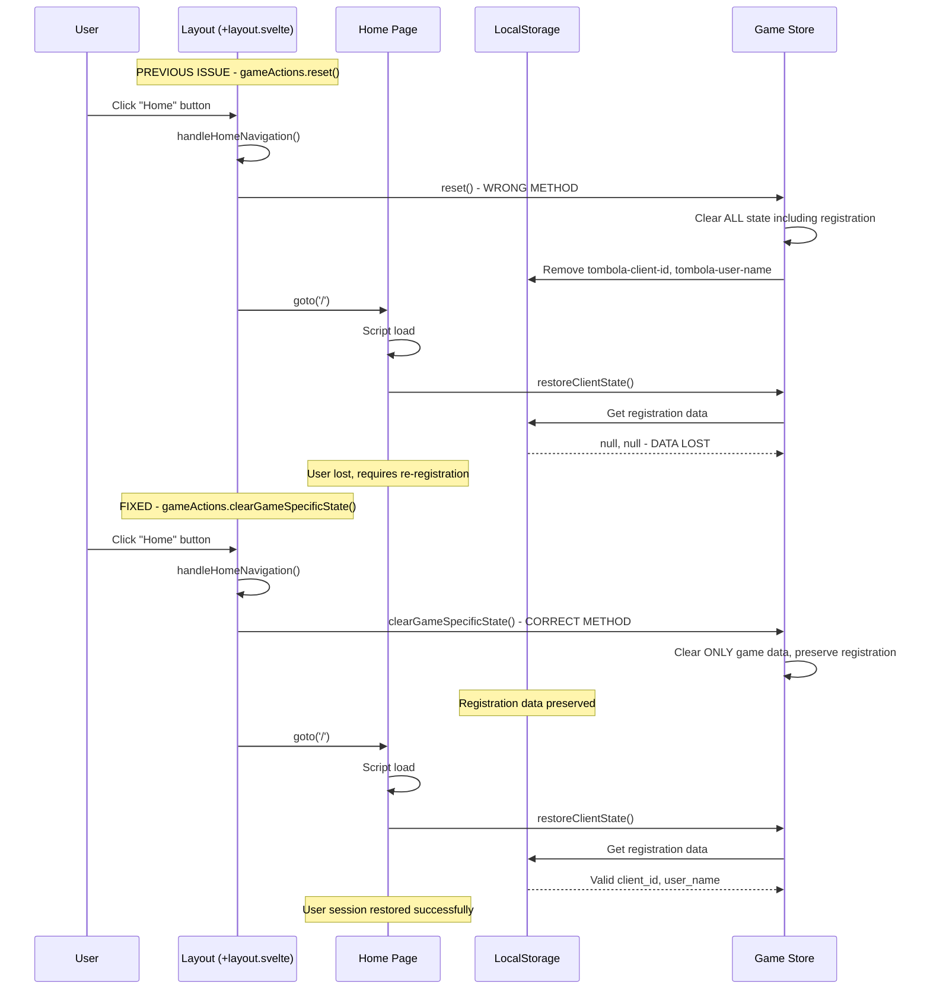
```mermaid
sequenceDiagram
    participant User as User
    participant Layout as Layout (+layout.svelte)
    participant HomePage as Home Page
    participant LocalStorage as LocalStorage
    participant GameStore as Game Store

    Note over Layout: PREVIOUS ISSUE - gameActions.reset()
    User->>Layout: Click "Home" button
    Layout->>Layout: handleHomeNavigation()
    Layout->>GameStore: reset() - WRONG METHOD
    GameStore->>GameStore: Clear ALL state including registration
    GameStore->>LocalStorage: Remove tombola-client-id, tombola-user-name
    Layout->>HomePage: goto('/')

    HomePage->>HomePage: Script load
    HomePage->>GameStore: restoreClientState()
    GameStore->>LocalStorage: Get registration data
    LocalStorage-->>GameStore: null, null - DATA LOST
    Note over HomePage: User lost, requires re-registration

    Note over Layout: FIXED - gameActions.clearGameSpecificState()
    User->>Layout: Click "Home" button
    Layout->>Layout: handleHomeNavigation()
    Layout->>GameStore: clearGameSpecificState() - CORRECT METHOD
    GameStore->>GameStore: Clear ONLY game data, preserve registration
    Note over LocalStorage: Registration data preserved
    Layout->>HomePage: goto('/')

    HomePage->>HomePage: Script load
    HomePage->>GameStore: restoreClientState()
    GameStore->>LocalStorage: Get registration data
    LocalStorage-->>GameStore: Valid client_id, user_name
    Note over HomePage: User session restored successfully
```

### 7.3 Cross-Page Navigation Flow

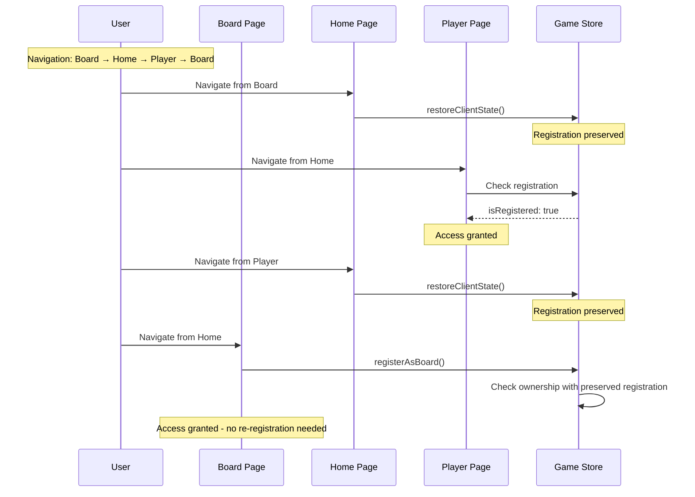
```mermaid
sequenceDiagram
    participant User as User
    participant BoardPage as Board Page
    participant HomePage as Home Page
    participant PlayerPage as Player Page
    participant GameStore as Game Store

    Note over User: Navigation: Board → Home → Player → Board

    User->>HomePage: Navigate from Board
    HomePage->>GameStore: restoreClientState()
    Note over GameStore: Registration preserved

    User->>PlayerPage: Navigate from Home
    PlayerPage->>GameStore: Check registration
    GameStore-->>PlayerPage: isRegistered: true
    Note over PlayerPage: Access granted

    User->>HomePage: Navigate from Player
    HomePage->>GameStore: restoreClientState()
    Note over GameStore: Registration preserved

    User->>BoardPage: Navigate from Home
    BoardPage->>GameStore: registerAsBoard()
    GameStore->>GameStore: Check ownership with preserved registration
    Note over BoardPage: Access granted - no re-registration needed
```

## 8. Data Persistence Flows

### 8.1 Client-side Data Persistence

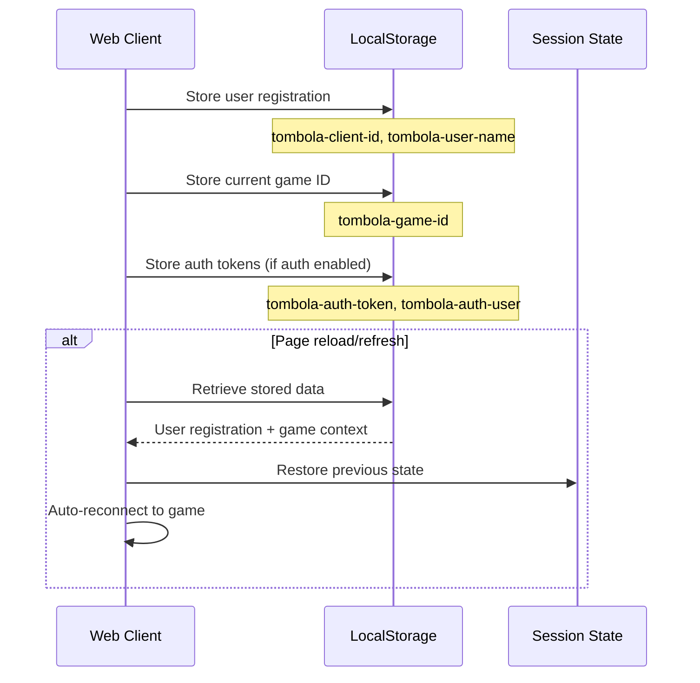
```mermaid
sequenceDiagram
    participant Client as Web Client
    participant LocalStorage as LocalStorage
    participant SessionState as Session State

    Client->>LocalStorage: Store user registration
    Note over LocalStorage: tombola-client-id, tombola-user-name

    Client->>LocalStorage: Store current game ID
    Note over LocalStorage: tombola-game-id

    Client->>LocalStorage: Store auth tokens (if auth enabled)
    Note over LocalStorage: tombola-auth-token, tombola-auth-user

    alt Page reload/refresh
        Client->>LocalStorage: Retrieve stored data
        LocalStorage-->>Client: User registration + game context
        Client->>SessionState: Restore previous state
        Client->>Client: Auto-reconnect to game
    end
```

### 8.2 Server-side Game Persistence

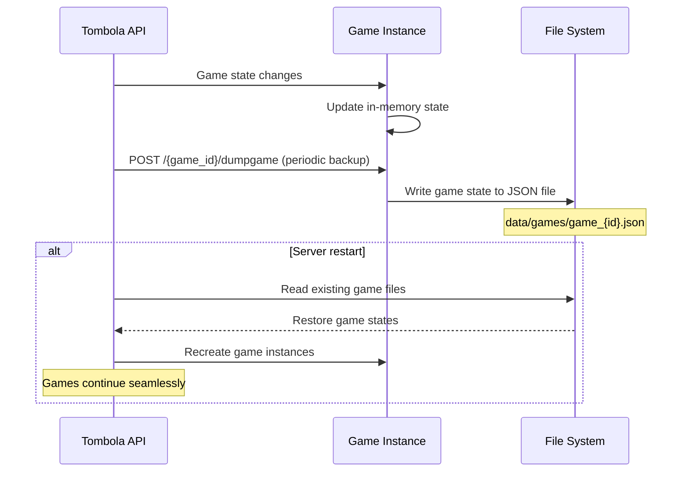
```mermaid
sequenceDiagram
    participant API as Tombola API
    participant Game as Game Instance
    participant FileSystem as File System

    API->>Game: Game state changes
    Game->>Game: Update in-memory state

    API->>Game: POST /{game_id}/dumpgame (periodic backup)
    Game->>FileSystem: Write game state to JSON file
    Note over FileSystem: data/games/game_{id}.json

    alt Server restart
        API->>FileSystem: Read existing game files
        FileSystem-->>API: Restore game states
        API->>Game: Recreate game instances
        Note over API: Games continue seamlessly
    end
```

## Notes

- **Authentication Modes**: The system supports both simple registration (name-only) and full authentication (Supabase magic links) based on server configuration
- **Session Management**: User registration persists across all page navigation scenarios through proper state management in `clearGameSpecificState()` vs `reset()`
- **Navigation Flow**: Fixed session loss issue where `handleHomeNavigation()` was incorrectly clearing user registration data
- **State Separation**: Clear distinction between game-specific state (cards, board data) and global user registration state
- **Real-time Updates**: All game interfaces use polling (3-second intervals) for real-time synchronization
- **State Isolation**: Each game maintains completely separate state using unique game IDs
- **Client Types**: Board clients have special privileges for game creation and number extraction
- **Error Recovery**: Robust error handling with automatic reconnection and state restoration
- **Responsive Design**: All flows work seamlessly across desktop, tablet, and mobile devices
